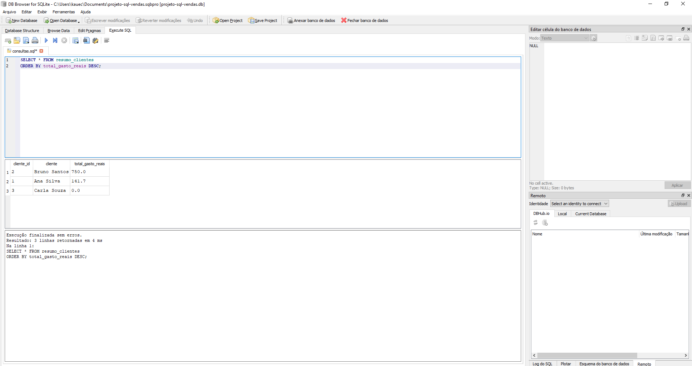

# Projeto SQL — Vendas

Projeto de estudo em SQL usando SQLite e DB Browser for SQLite, com dados fictícios de uma loja.

## O que o projeto faz

- Organiza clientes, produtos, pedidos e itens dos pedidos.
- Calcula o faturamento total.
- Mostra os produtos mais vendidos por quantidade.
- Consulta quanto cada cliente gastou, incluindo quem não comprou.
- Utiliza uma view para facilitar a consulta de gastos por cliente.

## Conceitos praticados

CREATE TABLE, INSERT INTO, SELECT, WHERE, JOIN, LEFT JOIN,
SUM, GROUP BY, ORDER BY, COALESCE e CREATE VIEW.

Também foram utilizadas chaves primárias, chaves estrangeiras
e restrições para impedir valores inválidos.

Os preços são armazenados em centavos e convertidos em reais
nas consultas. O estoque não é descontado automaticamente.

## Arquivos

- projeto_vendas.sql: estrutura, dados e view do banco.
- consultas.sql: exemplos de consultas e relatórios.
- imagens/: captura de tela do resultado.

## Como executar

1. Instale e abra o DB Browser for SQLite.
2. Acesse Arquivo → Importar → Banco de dados de arquivo SQL.
3. Selecione projeto_vendas.sql e salve o novo banco.
4. Na aba Executar SQL, abra consultas.sql.
5. Selecione a consulta desejada e execute.

Para validar as chaves estrangeiras ao inserir ou alterar dados,
execute PRAGMA foreign_keys = ON; a cada nova conexão,
antes de iniciar as alterações.

## Resultados dos dados de exemplo

- Faturamento total: R$ 891,70.
- Produto mais vendido: Mouse, com 2 unidades.
- Cliente com maior gasto: Bruno Santos, com R$ 750,00.

## Demonstração

